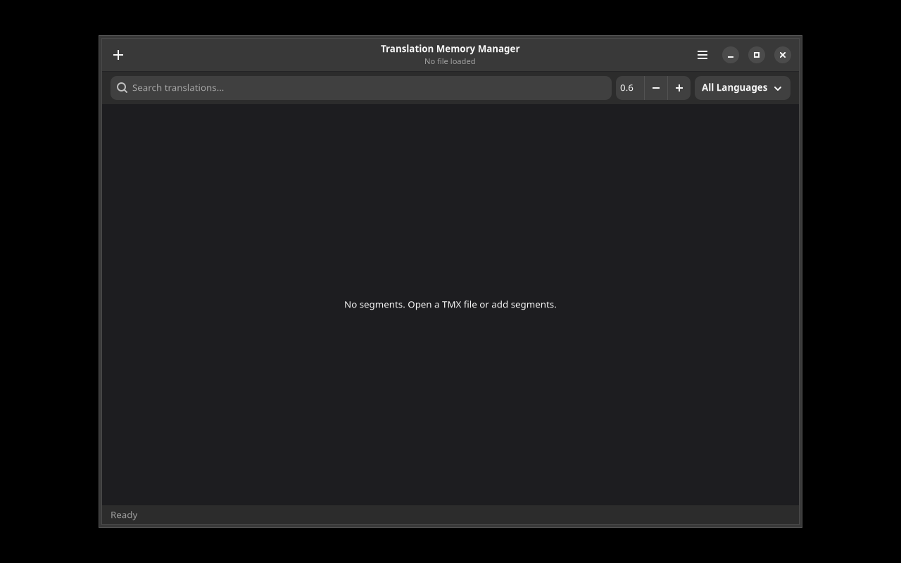

# Translation Memory Manager

A GTK4/Adwaita application for managing TMX translation memory files.



## Features

- Open and create TMX files
- Search translation memory with fuzzy matching
- Import from .po, .ts, .xliff to TMX
- Export TMX to other formats
- View statistics (segment count, language pairs)
- Filter by language, project, date
- Edit individual segments
- Merge two TMX files

## Installation

### Debian/Ubuntu

```bash
# Add repository
curl -fsSL https://yeager.github.io/debian-repo/KEY.gpg | sudo gpg --dearmor -o /usr/share/keyrings/yeager-archive-keyring.gpg
echo "deb [signed-by=/usr/share/keyrings/yeager-archive-keyring.gpg] https://yeager.github.io/debian-repo stable main" | sudo tee /etc/apt/sources.list.d/yeager.list
sudo apt update
sudo apt install tm-manager
```

### Fedora/RHEL

```bash
sudo dnf config-manager --add-repo https://yeager.github.io/rpm-repo/yeager.repo
sudo dnf install tm-manager
```

### From source

```bash
pip install .
tm-manager
```

## 🌍 Contributing Translations

This app is translated via Transifex. Help translate it into your language!

**[→ Translate on Transifex](https://app.transifex.com/danielnylander/tm-manager/)**

Currently supported: Swedish (sv). More languages welcome!

### For Translators
1. Create a free account at [Transifex](https://www.transifex.com)
2. Join the [danielnylander](https://app.transifex.com/danielnylander/) organization
3. Start translating!

Translations are automatically synced via GitHub Actions.
## License

GPL-3.0-or-later — Daniel Nylander <daniel@danielnylander.se>
